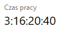
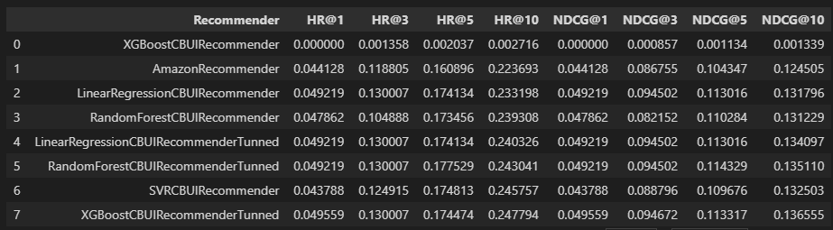
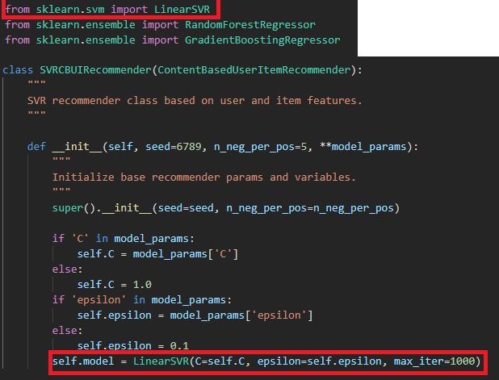
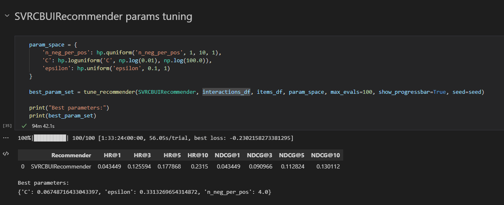
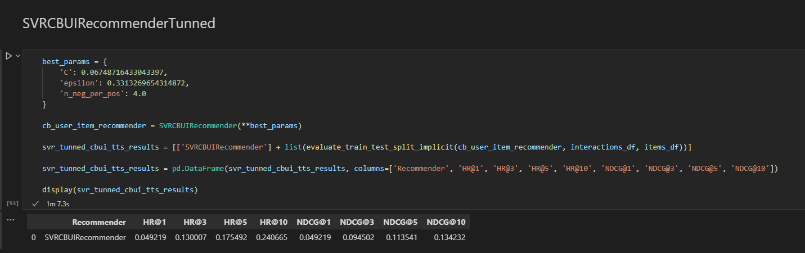

# Content Based Recommenders

Content based recommenders with data pre-processing on real buisness hotel data.

Most of the code belongs to **[Piotr Zioło](https://github.com/PiotrZiolo)**, who teaches "Recommendation Systems" in the summer semester 2021/2022. My contribution was to complete the tasks in the indicated places.

---

### Project contains:

:heavy_check_mark: **Cases of data pre-processing that can be found in real business projects**

:heavy_check_mark: **User features extraction with different approaches**

:heavy_check_mark: **Item features extraction**

:heavy_check_mark: **Content based recommender class**

:heavy_check_mark: **Wrapper LinearRegression, SVR, RandomForest, XGBoost recommender classes around base content based recommender**

:heavy_check_mark: **Tunning LinearRegression, SVR, RandomForest, XGBoost models with params comparison**

:heavy_check_mark: **Testing and validating LinearRegression, SVR, RandomForest, XGBoost models with results comparison**

:heavy_check_mark: **Beating Amazon Recommender in results after evaluating models with train test split implicit** :bangbang:

---

### Requirements:

1. Install [Anaconda](https://www.anaconda.com/products/individual) with Python 3.8.
2. Install [Visual Studio Code](https://code.visualstudio.com/docs/?dv=win) for comfortable working with jupyter notebooks
3. Open CMD and go to project folder where you can find env.yaml file - it contains information required to correctly create environment
4. Prepare your conda environment (instructions given for Windows 64bit)
```
conda env create --file env.yaml -n rs-cb-env python=3.8.0
```
5. Activate your newly created environment
```
conda activate rs-cb-env
```
6. Open main folder with Visual Studio Code
7. Install two extensions in Visual Studio Code: "Jupyter" and "Python"
8. Open desired .ipynb file and in the top-right side click "Select kernel" and choose your environment "rs-cb-env"
9. If Visual Studio Code will ask you to install ipykernel package, allow it and you are ready to go!
10. Start playing with the code!
---

### Package structure:

```
project_1_data_preparation.ipynb
project_1_recommender_and_evaluation.ipynb
|   
+---data
|   \---hotel_data
|           hotel_data_interactions_df.csv
|           hotel_data_original.csv
|           hotel_data_preprocessed.csv
|           
+---data_preprocessing
|    | 	dataset_specification.py
|    |  data_preprocessing_toolkit.py
|    |  people_identifier.py
|
+---evaluation_and_testing
|   |   evaluation_measures.py
|   |   testing.py        
|           
+---recommenders (
|   |   amazon_recommender.py
|   |   recommender.py
|
\--img
    |   performance.png   
    |   tunning_time.png
```

Data, data_preprocessing, evaluation_and_testing, recommenders folders mostly contains pre-prepared code by mentioned author.

Main content is in project_1_data_preparation.ipynb and project_1_recommender_and_evaluation.ipynb notebooks.

---

### Conclusion

#### Data Pre-processing
Data pre-processing part was cool and it was a good opportunity to get familiar with data. I had some issuess while doing that part but in the end I get it done.

#### User Features
I had different ideas for extracting user features after testing them I left only three of them in notebook. My first shot worth to mention was calculating the probability of occurancing given feature in user reservations. Then I tried to test most popular features in user reservations but the results were much worse and this approach was much slower (I might optimize that but I checked the results and they were worse so I didn't work on that anymore). I was looking for the way to improve recommender results and I had the feeling that user features might be done better. I have read some articles about Dimension Reduction and they way I understood that it might help a little but I decided not to include things I don't fully understand. At the end I sticked to simple probability distribution of features.

#### Items Features
Extracting items features was very quick. To be honest I didn't think much about looking for alternative approach because I think suggested one-hot is very good and it fits to data in my opinion.

#### Recommender class
In this part of the project, I tried different solutions again and thought about some concepts. I spent a lot of time trying to answer my self if it's better to try generate **unique** negative interactions (cost is a bit bigger time complexity) or allow to generate duplicates. I tried both with different user features extracting approaches and model **tuning** :sob: but in the end I didn't notice meaningful differences so I dropped the idea of unique negative interactions but I left trace of this idea in code. :feet:

Second nuisance was how to treat new user. It was important to handle it somehow because results were awful without it. I thought about two ideas: get average for all features of all users at it is probability it's not so bad and to treat new user as the user who has the most interactions and assign his features to new user. Second idea also seems not to be that bad as the top user choices could be quite cross-sectional and relevant. So tunning again... and again I didn't notice big improvements :sob:. Seeing that I decided to stick to AVG because it was quicker to extract.

#### Tunning
Tunning was destructive for me and my computer - I tuned different compositions for 4 days straight :skull:. It was really fun to wake up and see a little better result in 3rd decimal place again and again ... I focused on tunning RandomForest model and XGBoost. I had different parameters based on configuration (which user features method, unique negative interactions etc. - all stuff i wrote about) but finally I sticked to the parameters that are calculated in notebook. Tunning the SVR model was the hardest and I gave up on tunning this as 1 eval took nearly 180 minutes. I thought XGBoost will be the longest but SVR is on another level when it comes to tunning time (I assume this is because I have too many features?)

Unfortunately, I did not write down all the tuning results from the beginning, I only rejected the approach after seeing the results, but I have some of them:

```
linear
{'n_neg_per_pos': 4.0} - non unique negative interactions
linear
{'n_neg_per_pos': 2.0} - unique negative interactions
---------------------
svr
- one fit iteration 180 mintues... 100 evals impossible
---------------------
forest
{'max_depth': 7.0, 'min_samples_split': 7.0, 'n_estimators': 217.0, 'n_neg_per_pos': 4.0} - non unique negative interactions
forest
{'max_depth': 9.0, 'min_samples_split': 18.0, 'n_estimators': 49.0, 'n_neg_per_pos': 9.0} - unique negative interactions + user features approach with popularity
forest
---------------------
boost
{'learning_rate': 0.02674848891060033, 'max_depth': 6.0, 'min_samples_split': 8.0, 'n_estimators': 100.0, 'n_neg_per_pos': 6.0} - non unique negative interactions
boost
{'learning_rate': 0.012713530448885008, 'max_depth': 6.0, 'min_samples_split': 15.0, 'n_estimators': 142.0, 'n_neg_per_pos': 4.0} - unique negative interactions
```

**[*] For my PC**



#### Performance
I compared all the models with their tunned versions and the result is that it was possible to beat Amazon's score with all of them :bangbang:



#### Final words
The project was interesting and educating, it forced to consider several options to get a better result, it was also terribly time-consuming and resource-consuming.

### 05.05.2022 UPDATE

I have completly finished project on 2nd May but one thing still kept bothering me. As I said in Tunning section, SVR was weird - it was impossible to tune that recommender as one eval took more than 3-4 hours, also single run of that recommender took similar amount of time. Eventually result of my SVR recommender is not the best but when I was testing this (and waited 3 hours just to see results) I got various results (worse and better), one time it was even close to 0.26 in HR10. In the end I left that with another run because I think in this project when other recommenders need at most two minutes it's pointless to consider result from recommender which needs ~ 200 minutes... But still I was curious why it is so slow when other recommenders are pretty fast so I did research on my own.
I have found interesting post which states that using this version of SVR is the main reason:
https://stackoverflow.com/questions/47460201/scikit-learn-svr-runs-very-long
As the post states, LinearSVR should do much better so I tried to go with that. I modified base SVR class accordingly and imported that SVR model.



Then I checked how that recommender will work and now the time recomender needed became rational and tunning with 100 evals took 1 hour 30 minutes when before 1 eval took 4 hourse :)



The results of recommender wasn't game-changing so I finally didn't include any of that in my project as I did everything the project required already but I think it's interesting to consider that the base SVR class clearly stood out from the others and I wonder if the result of the SVR recommendation should be taken into account when the difference in the time needed to determine the recommendation is so drastically huge. What's more, the other recommendations (also the SVR that I reworked, which I have described here) returned quite similar results each time, while the basic, long SVR, depending on the launch, could return 0.17 one time and 0.27 next time. Due to the time needed to set a recommendation and high instability, I found that the SVR without rework should not be taken into account, despite the fact that it was able to return the best result on paper.


